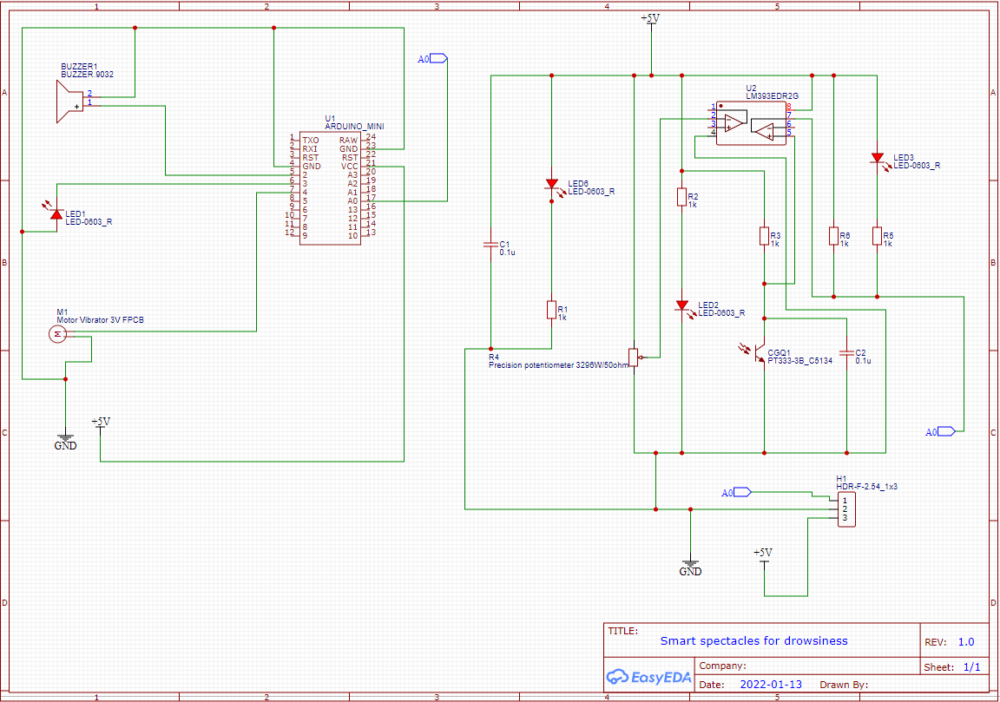
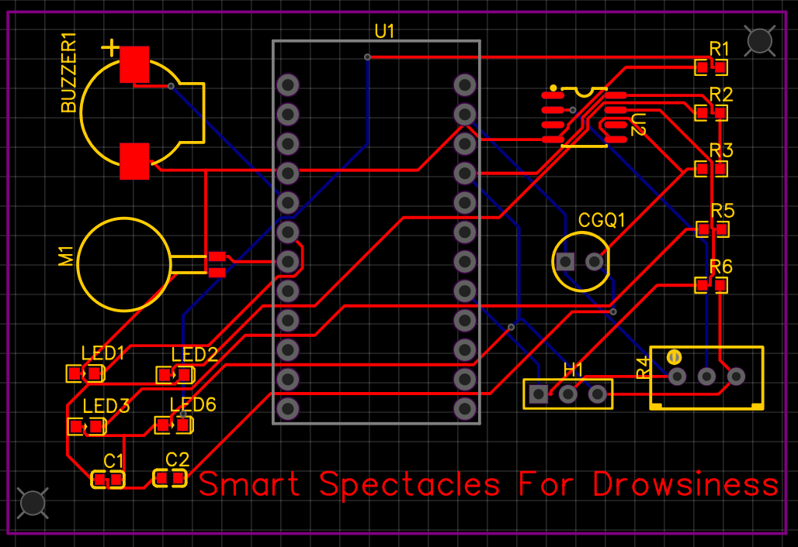
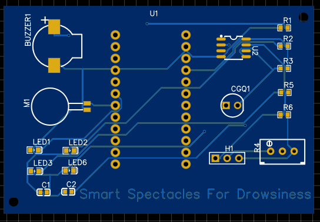
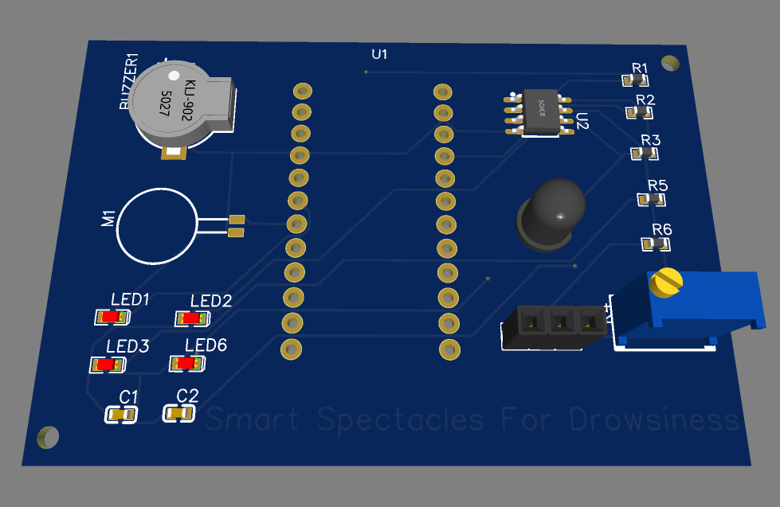

# Smart specs

In this smart specs circuitary using InfraRed based eye sensor is used to detect the eye blink of the drivers. 
In this we are used the tool for designing schematic and PCB is "EASY EDA" which is open source.

### Circuit diagram or schematic

### PCB

### 2D view

### 3D view

